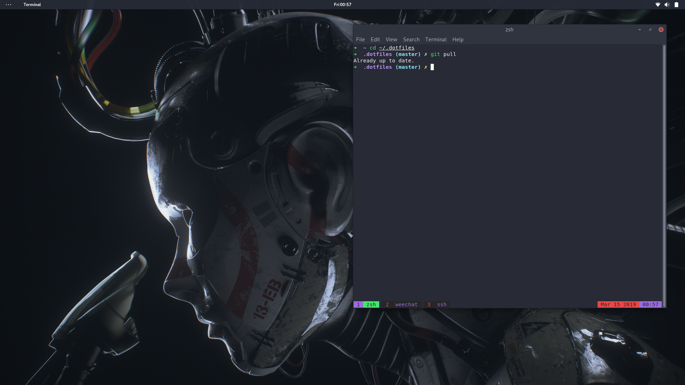

# dotfiles

## Project

The scope here is to create a singular script that can be run to set up a full terminal environment for any machine that I may be working on. Currently, it pulls the following items:
* ZSH (incl. oh-my-zsh, completions, autosuggestions and syntax highlighting)
* Dracula themes (ZSH, vim)
* Vim (incl. Pathogen, nerdtree, terminus)
* Ranger file browser, thefuck, CLI tools for cloud management, and more
* My personal dotfiles

## Preview



## Install

* For Fedora:
```
bash -c "$(curl -fsSL https://raw.githubusercontent.com/garrettjj/dotfiles/master/fedora.sh)"
```

## toDo

Review and update any broken dependencies

## Contributions

While this is a personal project, I'm more than happy to review feedback from other individuals on this matter. Feel free to submit pull requests and I'll review them appropriately.

## Credit

While a dotfile repository isn't anything original, credit the idea and certain blocks of code goes to jldeen's [dotfiles](https://github.com/jldeen/dotfiles). 
